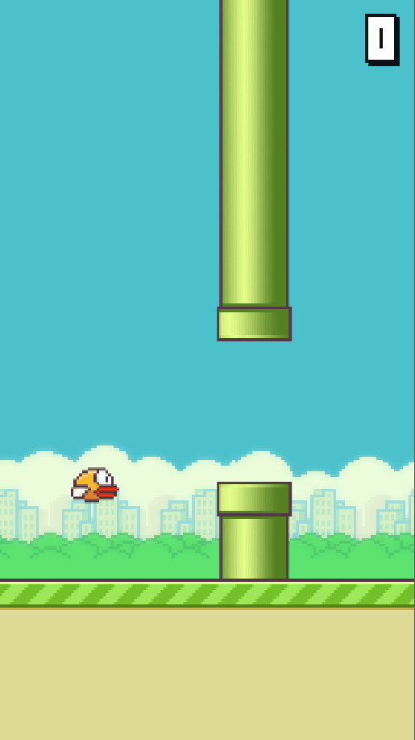
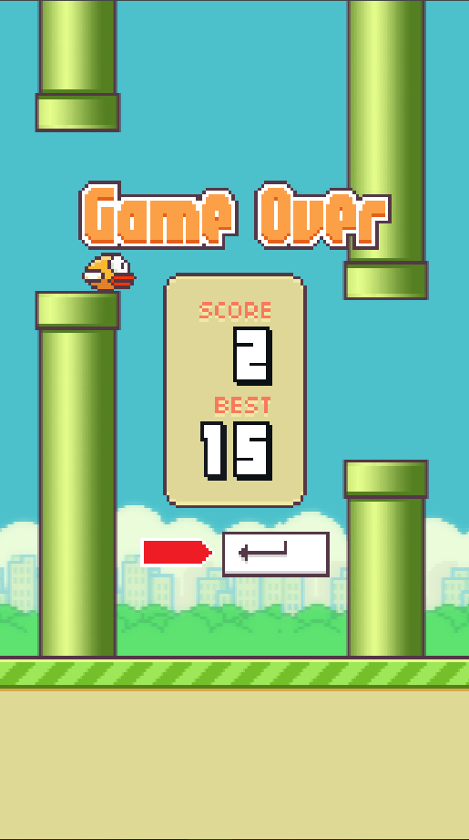

# Flappy Bird JavaScript
Esse projeto foi desenvolvido com o intuito de treinar lógica de programação, criando uma cópia do jogo Flappy Bird utilizando a linguagem JavaScript. O objetivo foi mexer o mínimo possível com HTML e CSS. O modo de funcionamento e funções do jogo foram inspiradas em uma game engine, mais especificamente o GameMaker Studio 2.

Clique [aqui](https://flappy-clone-scarymaestros-projects.vercel.app/) para testar o projeto.

 

Clone simples de Flappy Bird criado para fins educacionais. O projeto não têm vínculo com o jogo original.
